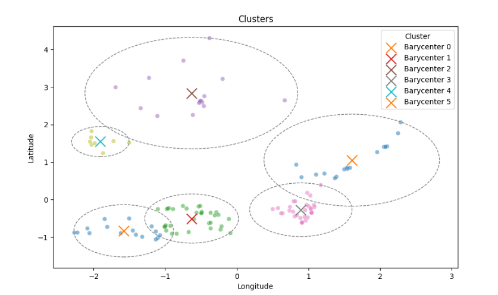

# Dingoo Challenge

## EDA (Exploratory Data Analysis)

Firstly, the data doesn't have any missing values. 
It has `4745 entries` with 4 columns : `Cód.Postal`,`Localidade`,
`Morada completa`,`GPS - Latitude` and `GPS - Longitude`.  

Since I have access to coordinates, I decide to plot the distribution of deliveries by locations:  
  
  
  
And zoomed, we get :  
  

  
  
The first thing that surprises me is that globaly, 
we have a huge cluster with some few points that we will have to treat apart.  

We can look for where the density is the highest using a density map :  

  
Not surprisingly, the highest density is near the city center.

I tried to see how postal codes are distribuated, It gives a good idea what zones 
are covered.

## Clusters

Now that we have an idea of what the data is and how It is represented, we are going to look for
clusters of locations.  
Since the number of locations inside a cluster is a parameter, I am going to use `KMEANS`.
It will use centroids that will choose locations that minimizes the distance from them.
By the way, these centroids will give us a good position for the restock "hub" because in each cluster,
the centroids have the lowest distance from each locations of the cluster.

Note that I have used `random_state = 42` in this part to be able to compare data without worrying about randomness.

First, I applied the algorithm and plot the result raw :

As we can see, clusters seems to be found but It is clearly not visible.
Lets try to plot circles that take as center the centroid of the cluster and the radius
the maximum of the distances from the centroid.

It starts to be much more visible but let's remove some clusters and take
only 0,1 and 2.

Cluster 0 and 1 are very acceptable since they manage to gather very closely the locations.
But the problem is with cluster 2, we see that most of the locations are far from the centroid
which leads to a huge circle with a lot of blank spaces. Let's see the other
clusters for exemple 4,5 and 6.

We see that the problem remains. Good thing is that the clusters seems to be coherent.
This means that centroids won't be usefull. Let's try another approach and compute "new" centroids, which are called barycenter, using the cluster found by kmeans. I will use this formula :

Now let's plot the circles but this time around the barycenters :

We see that the barycenters seems to be much more coherent to use. My question is what if we train kmean one time on random centroids to have an idea of where the centroids are then train it again using the barycenters that we have just computed ? So let's try :

