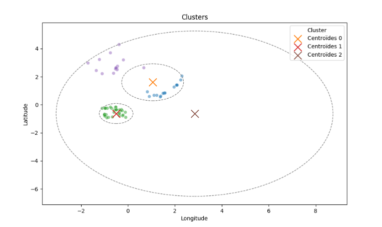
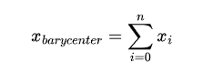

# Dingoo Challenge

## About the code

Every plots that I have used is available in the differents `.py` files.
Each method is describe and what it should ouput.

Note: I am aware that this is not flexible enough to be able to receive other
types of data (for exemple another type of excel etc). I thought about a
pipeline that would probably support the whole thing but I don't think
I will have time to implement it before saturday.
This one is robust enough as long as columns names are respected.

## EDA (Exploratory Data Analysis)

Firstly, the data doesn't have any missing values. 
It has `4745 entries` with 4 columns : `Cód.Postal`,`Localidade`,
`Morada completa`,`GPS - Latitude` and `GPS - Longitude`.  

Since I have access to coordinates, I decide to plot the distribution of deliveries by locations:  
  
  
  
And zoomed, we get :  
  

  
  
The first thing that surprises me is that globaly, 
we have a huge cluster with some few points that we will have to treat apart.  

We can look for where the density is the highest using a density map :  

  
Not surprisingly, the highest density is near the city center.

I tried to see how postal codes are distribuated, It gives a good idea what zones 
are covered.

## Clusters

Now that we have an idea of what the data is and how It is represented, we are going to look for
clusters of locations.  
Since the number of locations inside a cluster is a parameter, I am going to use `KMEANS`.
It will use centroids that will choose locations that minimizes the distance from them.
By the way, these centroids will give us a good position for the restock "hub" because in each cluster,
the centroids have the lowest distance from each locations of the cluster.

Note: my review is structured temporally (even though I had to comeback on certain parts to
correct them), I tried to explore and report like the way I would think about it.

### Metrics

I didn't know metrics to evaluate clusters so I have done research 
and came across `silhouette score`. I will be using the one from `sklearn`.
We will be comparing data, so as for now, 
I will remove the randomness (to be precise, I will choose a random state) 
from the code until the conclusion where I will do statistics to see if it is relevant on large scale of time. 
It means that the initial centroids will be fixed 
but chosen randomly (`random_state = 42`), I will select 250 locations from a fixed random locations (`random_state = 42`)

### First call to the algorithm

First, I applied the algorithm and plot the result raw.

### Scaling data

In this case, we see that we don't have outline values but we know they exist.
KMeans would have issues treating them.
A simple solution is to scale the data :

### Plot the circles based on the centroids

As we can see, clusters seems to be found but It is clearly not visible.

We get a `silhouette score = 0.43552443286869597` which is great but not perfect
since we are looking for a value that is close to 1. 
Lets try to plot circles that take as center the centroid of the cluster and the radius
the maximum of the distances from the centroid to see what is going on.

It starts to be much more visible but let's remove some clusters and take
only 0,1 and 2.

And now clusters 4,5 and 6.

We see that the centroids don't really represent the center of the clusters
which means they won't be useful to know where to put the "restock hubs".
Let's try another approach and compute the barycenters of the clusters
using these formulas :

Now let's plot the circles but this time around the barycenters :

We see that the barycenters seems to be much more coherent to use. 
So my question is what if we train kmean one time on random centroids 
to have an idea of where the centroids are then train it again using 
the barycenters that we have just computed ? 
I thought about it because KMeans minimizes the distances from the centroids and since barycenters
are the "mean" of the minimum when it comes to the distances from locations of the cluster.
So let's try :

We get a `silouhette_score = 0.4104913499777463` which makes it a bit worse than before but still relatively close.
Yet, let's not forget that it makes 
it worst on this particular case (cf removed randomness) but it doesn't mean
it will be worst for other cases. 
Which means we will have to do some statistics to see if it is true or not.

### Statistics

Since statistics can easily become really deep, I am going to stay on the surface.
I am going to use the `random_state` to range and sample data : 
for each kmeans that will be computed on this seed, I will compute the silhouette score
of the one generated using "normal centroids" and the one using barycenters as centroids.
I am going to assume to compare the mean of the silhouette scores.
I will choose seed from `random_state = 0` to `random_state = 100`.

We get `silhouette_score_centroid = 0.4451892411594596` and 
`silhouette_score_barycenters = 0.4282781939417761` which means in this case, my method
is slightly less efficient. To go even further, I should play with the other parameters
such as the number of locations inside each clusters for exemple.

### Another approach : numbers of clusters

