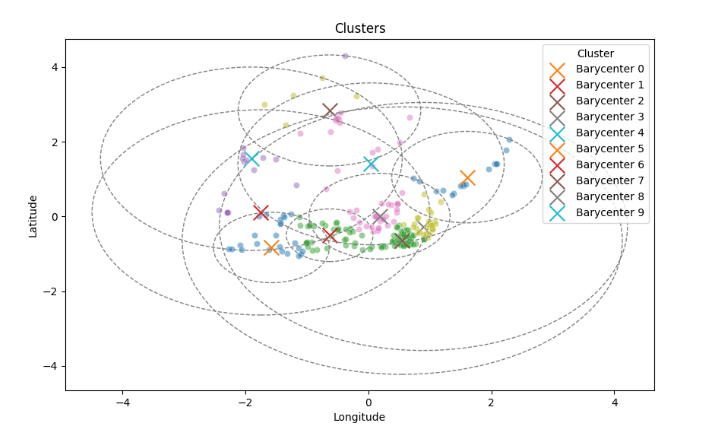

# Dingoo Challenge

## About the code

Every plots that I have used is available in the differents `.py` files.
Each method is describe and what it should ouput.
Each plot is numbered in `main.py` so that eveything I have shown
is reproductible.

I have used AI generation for docstring documentation, since I was short on time. I hope
it is not an issue. I have used it only
for this task, every other things has been written by hand by me.

Note: I am aware that this is not flexible enough to be able to receive other
types of data (for exemple another type of excel etc). I thought about a
pipeline that would probably support the whole thing but I don't think
I will have time to implement it before saturday.
This one is robust enough as long as columns names are respected.

## EDA (Exploratory Data Analysis)

Firstly, the data doesn't have any missing values. 
It has `4745 entries` with 4 columns : `Cód.Postal`,`Localidade`,
`Morada completa`,`GPS - Latitude` and `GPS - Longitude`.  

Since I have access to coordinates, I decided to plot the distribution of deliveries by locations:  

Plot 1
  
  
And zoomed, we get :  
  
Plot 1

  
  
The first thing that surprises me is that globaly, 
we have a huge cluster with some few points that we will have to treat apart.  

We can look for where the density is the highest using a density map :

Plot 2

  
Not surprisingly, the highest density is near the city center.

I tried to see how postal codes are distribuated, It gives a good idea what zones 
are covered.

Plot 3

## Clusters

Now that we have an idea of what the data is and how It is represented, we are going to look for
clusters of locations.  
Since the number of locations inside a cluster is a parameter, I am going to use `KMEANS`.
It will use centroids that will choose locations that minimizes the distance from them.
By the way, these centroids will give us a good position for the restock "hub" because in each cluster,
the centroids have the lowest distance from each locations of the cluster.

Note: my review is structured temporally (even though I had to comeback on certain parts to
correct them), I tried to explore and report like the way I would think about it.

### Metrics

I didn't know metrics to evaluate clusters so I have done research 
and came across `silhouette score`. I will be using the one from `sklearn`.
We will be comparing data, so as for now, 
I will remove the randomness (to be precise, I will choose a random state) 
from the code until the conclusion where I will do statistics to see if it is relevant on large scale of time. 
It means that the initial centroids will be fixed 
but chosen randomly (`random_state = 42`), I will select 250 locations from a fixed random locations (`random_state = 42`)

### First call to the algorithm

First, I applied the algorithm and plot the result raw.

Plot 4

### Scaling data

In this case, we see that we don't have outline values but we know they exist.
KMeans would have issues treating them.
A simple solution is to scale the data :

Plot 5

### Plot the circles based on the centroids

As we can see, clusters seems to be found but It is clearly not visible.

We get a `silhouette score = 0.43552443286869597` which is great but not perfect
since we are looking for a value that is close to 1. 
Lets try to plot circles that take as center the centroid of the cluster and the radius
the maximum of the distances from the centroid to see what is going on.

Plot 6

It starts to be much more visible but let's remove some clusters and take
only 0,1 and 2.

Plot 6

And now clusters 4,5 and 6.

Plot 6

We see that the centroids don't really represent the center of the clusters
which means they won't be useful to know where to put the "restock hubs".
Let's try another approach and compute the barycenters of the clusters
using these formulas :

Now let's plot the circles but this time around the barycenters :

Plot 7

We see that the barycenters seems to be much more coherent to use. 
So my question is what if we train kmean one time on random centroids 
to have an idea of where the centroids are then train it again using 
the barycenters that we have just computed ? 
I thought about it because KMeans minimizes the distances from the centroids and since barycenters
are the "mean" of the minimum when it comes to the distances from locations of the cluster.
So let's try :

Plot 8

We get a `silouhette_score = 0.4104913499777463` which makes it a bit worse than before but still relatively close.
Yet, let's not forget that it makes 
it worst on this particular case (cf removed randomness) but it doesn't mean
it will be worst for other cases. 
Which means we will have to do some statistics to see if it is true or not.

### Statistics

Since statistics can easily become really deep, I am going to stay on the surface.
I am going to use the `random_state` to range and sample data : 
for each kmeans that will be computed on this seed, I will compute the silhouette score
of the one generated using "normal centroids" and the one using barycenters as centroids.
I am going to assume to compare the mean of the silhouette scores.
I will choose seed from `random_state = 0` to `random_state = 100`.

Plot 9

We get `silhouette_score_centroid = 0.4451892411594596` and 
`silhouette_score_barycenters = 0.4282781939417761` which means in this case, my method
is slightly less efficient. To go even further, I should play with the other parameters
such as the number of locations inside each clusters for exemple. There are also a lot of 
statistical aspect that I dont approach (hypothesis, standard deviation etc) 
because of time.

### Another approach : numbers of clusters

Now that I thought about statistics, there is one parameter that I should
have thought about directly : the number of clusters.
We are capped because we want between 20 to 30 locations per clusters,
but we still have a margin of approach. We come back on the "normal"
centroid approach.

So let's see what results we have if we lock again `random_state = 42`.
`loc_per_clusters` will go from 5 to 60 (not (20 - 30) because even if we are capped,
we want to see if the maximum we found might be only local ), we are going to see
how `silhouette_score_centroid` change.

Plot 10

We see that the maximum for our range is around 20 locations per clusters. Let's not forget
that it is only for `random_state = 42`.
Since we are looking for an answer, let's find the maximum for multiple seeds (here a 100)
and compute the barycenter of all those points, this way we will have a weighted mean of
the coordinates. Here is the plot to make more clear :

Plot 11

We get a maximum score of `0.5205499806280309` between 20 and 30 locations per clusters reached on `30` locations per clusters.
So if we assume that this statistic is representative of our sample, this is the optimum we should choose. But again, my statistics are very basic and might not be representative of the entire sample, but I will assume it to represent my idea.

Note : this tweak "only" enhance the score to about 0.2 in the best case, in general.

### Not restraining the number of locations per clusters

On the 2 differents plots just before we see that we could get better performances with a bigger or lower number of locations per clusters but I suspect it to be overfitting or underfitting.
First let's see the previous plot but with a range of number of locations per clusters from 5 to about 60, still on 100 different seeds. 

Plot 12

We get a maximum score of `0.596043580771597` reached for 60 locations per clusters.
Let's plot the map to see what it looks like (for `random_state = 42`): 

Plot 13

We see that we have clear clusters that almost don't override each other, which explain why the score is better, but we see that they are clusters that are that locations that are very far away from each others.

### Conclusion

To conclude, I have used kmeans algorithm because we are capped with locations per clusters so ultimately, the number of clusters : this is why I thought about it.

We had 2 approachs to enhance the performance:

- Use custom centroids, here the barycenter of the first clusters computed
- Try to find the most optimum number of locations per cluster

## Areas for improvement

Since I was in lack of time, I had to avoid some subjects (that could improve
the performance or atleast give a good idea if specific method are good enough)
such as :

- Use other algorithms (such as DBScan for exemple)
- Perfom rigorous statistics
- Explore clusters interactively
- Automatise the analyse for any type of data (developp a flexible framework)

